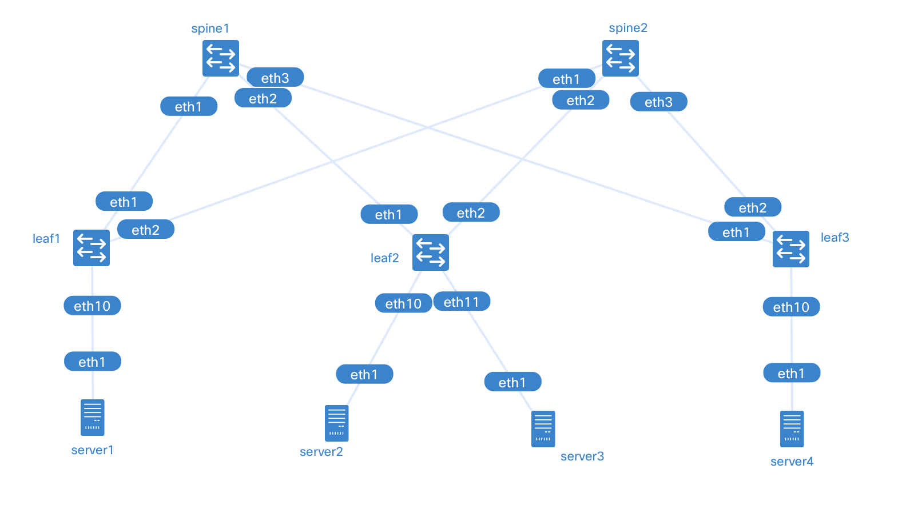

# Cisco Nexus 9000v Switch - EVPN over VXLAN Lab
| Items | Description |
| --- | --- |
| Description | A lab to demonstrate EVPN over VXLAN on Cisco Nexus 9000v Switch with containerlab |
| Components | Cisco Nexus 9000v, Multitool Alpine Linux |
| Resource requirements | N/A[^1] |
| Topology file | n9kv-evpn-vxlan.clab.yml |
| Name | n9kv-evpn-vxlan |
| Version information | vr-n9kv:9.3.13, [containerlab](https://containerlab.dev):0.54.2, [docker-ce](https://www.docker.com):24.0.5 |

# Description
The lab has Cisco Nexus 9000v connected in a Clos topology: two nodes as Spine and three nodes as Leaf, all with management interfaces also connected to the containerlab docker network.
The Cisco Nexus 9000v VM is launched as a container using [vrnetlab](https://github.com/vrnetlab/vrnetlab) integration.
The configuration uses iBGP as the underlay, with the reachability of each neighbor via OSPF; the overlay runs EVPN over VXLAN, and BUM handling is handled via ingress replication.
BUM handling is handled through Ingress Replication.
CE1 and CE2 are assigned to VLAN 10, CE3 and CE4 are assigned to VLAN 20, and there is no interconnectivity between VLAN 10 and VLAN 20.

- Topology: Clos
- Underlay: iBGP with OSPF
- Overlay: EVPN over VXLAN
- BUM: Ingress Replication
- Client: VLAN10, VLAN20



# Use cases
This lab allows you to launch a basic interoperability scenario for a multi-tenant environment on EVPN over VXLAN using the Cisco Nexus 9000v.
The lab directory contains the basic configuration files used to start the interoperability demonstration.

# Parameters
| Role | Image | Hostname | IP address | VLAN |
| --- | --- | --- | --- | --- |
| Spine | Nexus 9000v | SPINE1 | 10.0.0.1 | |
| Spine | Nexus 9000v | SPINE2 | 10.0.0.2 | |
| Leaf | Nexus 9000v | LEAF1 | 10.0.0.11 | |
| Leaf | Nexus 9000v | LEAF2 | 10.0.0.12 | |
| Leaf | Nexus 9000v | LEAF3 | 10.0.0.13 | |
| Client | Alpine Linux | SERVER1 | 192.168.10.1 | 10 |
| Client | Alpine Linux | SERVER2 | 192.168.10.2 | 10 |
| Client | Alpine Linux | SERVER3 | 192.168.20.3 | 20 |
| Client | Alpine Linux | SERVER4 | 192.168.20.4 | 20 |

# Outputs
```
root@ip-10-10-0-55:~/n9kv-evpn-vxlan-lab# clab inspect
INFO[0000] Parsing & checking topology file: n9kv-evpn-vxlan.clab.yml 
+---+---------+--------------+---------------------------------+------------+---------+-----------------+----------------------+
| # |  Name   | Container ID |              Image              |    Kind    |  State  |  IPv4 Address   |     IPv6 Address     |
+---+---------+--------------+---------------------------------+------------+---------+-----------------+----------------------+
| 1 | leaf1   | be50d3a0345a | vrnetlab/vr-n9kv:9.3.13         | cisco_n9kv | running | 172.20.20.9/24  | 2001:172:20:20::9/64 |
| 2 | leaf2   | ea04c8be287c | vrnetlab/vr-n9kv:9.3.13         | cisco_n9kv | running | 172.20.20.10/24 | 2001:172:20:20::a/64 |
| 3 | leaf3   | 02a4efb8ea9d | vrnetlab/vr-n9kv:9.3.13         | cisco_n9kv | running | 172.20.20.3/24  | 2001:172:20:20::3/64 |
| 4 | server1 | 29246614fe71 | ghcr.io/hellt/network-multitool | linux      | running | 172.20.20.4/24  | 2001:172:20:20::4/64 |
| 5 | server2 | 0fb166bef4b6 | ghcr.io/hellt/network-multitool | linux      | running | 172.20.20.7/24  | 2001:172:20:20::7/64 |
| 6 | server3 | 47e1293e7e62 | ghcr.io/hellt/network-multitool | linux      | running | 172.20.20.8/24  | 2001:172:20:20::8/64 |
| 7 | server4 | d5be3118a834 | ghcr.io/hellt/network-multitool | linux      | running | 172.20.20.5/24  | 2001:172:20:20::5/64 |
| 8 | spine1  | d80aae46fe3d | vrnetlab/vr-n9kv:9.3.13         | cisco_n9kv | running | 172.20.20.6/24  | 2001:172:20:20::6/64 |
| 9 | spine2  | 5108c9903924 | vrnetlab/vr-n9kv:9.3.13         | cisco_n9kv | running | 172.20.20.2/24  | 2001:172:20:20::2/64 |
+---+---------+--------------+---------------------------------+------------+---------+-----------------+----------------------+
root@ip-10-10-0-55:~/n9kv-evpn-vxlan-lab# 
```
```
root@ip-10-10-0-55:~/n9kv-evpn-vxlan-lab# docker exec -it server1 ash
server1:/# 
server1:/# ping 192.168.10.2
PING 192.168.10.2 (192.168.10.2) 56(84) bytes of data.
64 bytes from 192.168.10.2: icmp_seq=1 ttl=64 time=3.22 ms
64 bytes from 192.168.10.2: icmp_seq=2 ttl=64 time=3.03 ms
64 bytes from 192.168.10.2: icmp_seq=3 ttl=64 time=3.26 ms
^C
--- 192.168.10.2 ping statistics ---
3 packets transmitted, 3 received, 0% packet loss, time 2003ms
rtt min/avg/max/mdev = 3.028/3.170/3.260/0.101 ms
server1:/# 
```
```
LEAF2# show ip route 
IP Route Table for VRF "default"
'*' denotes best ucast next-hop
'**' denotes best mcast next-hop
'[x/y]' denotes [preference/metric]
'%<string>' in via output denotes VRF <string>

10.0.0.1/32, ubest/mbest: 1/0
    *via 10.1.2.1, Eth1/1, [110/41], 00:33:47, ospf-UNDERLAY, intra
10.0.0.2/32, ubest/mbest: 1/0
    *via 10.2.2.2, Eth1/2, [110/41], 00:33:46, ospf-UNDERLAY, intra
10.0.0.11/32, ubest/mbest: 2/0
    *via 10.1.2.1, Eth1/1, [110/81], 00:33:39, ospf-UNDERLAY, intra
    *via 10.2.2.2, Eth1/2, [110/81], 00:33:39, ospf-UNDERLAY, intra
10.0.0.12/32, ubest/mbest: 2/0, attached
    *via 10.0.0.12, Lo0, [0/0], 00:34:08, local
    *via 10.0.0.12, Lo0, [0/0], 00:34:08, direct
10.0.0.13/32, ubest/mbest: 2/0
    *via 10.1.2.1, Eth1/1, [110/81], 00:33:27, ospf-UNDERLAY, intra
    *via 10.2.2.2, Eth1/2, [110/81], 00:33:27, ospf-UNDERLAY, intra
10.1.1.0/24, ubest/mbest: 1/0
    *via 10.1.2.1, Eth1/1, [110/80], 00:33:47, ospf-UNDERLAY, intra
10.1.2.0/24, ubest/mbest: 1/0, attached
    *via 10.1.2.12, Eth1/1, [0/0], 00:34:08, direct
10.1.2.12/32, ubest/mbest: 1/0, attached
    *via 10.1.2.12, Eth1/1, [0/0], 00:34:08, local
10.1.3.0/24, ubest/mbest: 1/0
    *via 10.1.2.1, Eth1/1, [110/80], 00:33:47, ospf-UNDERLAY, intra
10.2.1.0/24, ubest/mbest: 1/0
    *via 10.2.2.2, Eth1/2, [110/80], 00:33:46, ospf-UNDERLAY, intra
10.2.2.0/24, ubest/mbest: 1/0, attached
    *via 10.2.2.12, Eth1/2, [0/0], 00:34:08, direct
10.2.2.12/32, ubest/mbest: 1/0, attached
    *via 10.2.2.12, Eth1/2, [0/0], 00:34:08, local
10.2.3.0/24, ubest/mbest: 1/0
    *via 10.2.2.2, Eth1/2, [110/80], 00:33:46, ospf-UNDERLAY, intra

LEAF2# 
```
```
LEAF2# show ip ospf neighbors 
 OSPF Process ID UNDERLAY VRF default
 Total number of neighbors: 2
 Neighbor ID     Pri State            Up Time  Address         Interface
 10.0.0.1          1 FULL/ -          00:34:16 10.1.2.1        Eth1/1 
 10.0.0.2          1 FULL/ -          00:34:15 10.2.2.2        Eth1/2 
LEAF2# 
```
```
LEAF2# show bgp l2vpn evpn summary 
BGP summary information for VRF default, address family L2VPN EVPN
BGP router identifier 10.0.0.12, local AS number 65000
BGP table version is 32, L2VPN EVPN config peers 2, capable peers 2
18 network entries and 24 paths using 4392 bytes of memory
BGP attribute entries [14/2408], BGP AS path entries [0/0]
BGP community entries [0/0], BGP clusterlist entries [4/16]

Neighbor        V    AS MsgRcvd MsgSent   TblVer  InQ OutQ Up/Down  State/PfxRcd
10.0.0.1        4 65000      45      43       32    0    0 00:34:09 6         
10.0.0.2        4 65000      45      39       32    0    0 00:34:14 6         
LEAF2# 
```
```
LEAF2# show bgp l2vpn evpn
BGP routing table information for VRF default, address family L2VPN EVPN
BGP table version is 32, Local Router ID is 10.0.0.12
Status: s-suppressed, x-deleted, S-stale, d-dampened, h-history, *-valid, >-best
Path type: i-internal, e-external, c-confed, l-local, a-aggregate, r-redist, I-injected
Origin codes: i - IGP, e - EGP, ? - incomplete, | - multipath, & - backup, 2 - best2

   Network            Next Hop            Metric     LocPrf     Weight Path
Route Distinguisher: 10.0.0.11:32777
*>i[2]:[0]:[0]:[48]:[0000.0000.1111]:[0]:[0.0.0.0]/216
                      10.0.0.11                         100          0 i
* i                   10.0.0.11                         100          0 i
*>i[2]:[0]:[0]:[48]:[0000.0000.1111]:[32]:[192.168.10.1]/248
                      10.0.0.11                         100          0 i
* i                   10.0.0.11                         100          0 i
*>i[3]:[0]:[32]:[10.0.0.11]/88
                      10.0.0.11                         100          0 i
* i                   10.0.0.11                         100          0 i

Route Distinguisher: 10.0.0.12:32777    (L2VNI 100010)
*>i[2]:[0]:[0]:[48]:[0000.0000.1111]:[0]:[0.0.0.0]/216
                      10.0.0.11                         100          0 i
*>l[2]:[0]:[0]:[48]:[0000.0000.2222]:[0]:[0.0.0.0]/216
                      10.0.0.12                         100      32768 i
*>i[2]:[0]:[0]:[48]:[0000.0000.1111]:[32]:[192.168.10.1]/248
                      10.0.0.11                         100          0 i
*>l[2]:[0]:[0]:[48]:[0000.0000.2222]:[32]:[192.168.10.2]/248
                      10.0.0.12                         100      32768 i
*>i[3]:[0]:[32]:[10.0.0.11]/88
                      10.0.0.11                         100          0 i
*>l[3]:[0]:[32]:[10.0.0.12]/88
                      10.0.0.12                         100      32768 i

Route Distinguisher: 10.0.0.12:32787    (L2VNI 100020)
*>l[2]:[0]:[0]:[48]:[0000.0000.3333]:[0]:[0.0.0.0]/216
                      10.0.0.12                         100      32768 i
*>i[2]:[0]:[0]:[48]:[0000.0000.4444]:[0]:[0.0.0.0]/216
                      10.0.0.13                         100          0 i
*>l[2]:[0]:[0]:[48]:[0000.0000.3333]:[32]:[192.168.20.3]/248
                      10.0.0.12                         100      32768 i
*>i[2]:[0]:[0]:[48]:[0000.0000.4444]:[32]:[192.168.20.4]/248
                      10.0.0.13                         100          0 i
*>l[3]:[0]:[32]:[10.0.0.12]/88
                      10.0.0.12                         100      32768 i
*>i[3]:[0]:[32]:[10.0.0.13]/88
                      10.0.0.13                         100          0 i

Route Distinguisher: 10.0.0.13:32787
* i[2]:[0]:[0]:[48]:[0000.0000.4444]:[0]:[0.0.0.0]/216
                      10.0.0.13                         100          0 i
*>i                   10.0.0.13                         100          0 i
*>i[2]:[0]:[0]:[48]:[0000.0000.4444]:[32]:[192.168.20.4]/248
                      10.0.0.13                         100          0 i
* i                   10.0.0.13                         100          0 i
* i[3]:[0]:[32]:[10.0.0.13]/88
                      10.0.0.13                         100          0 i
*>i                   10.0.0.13                         100          0 i

LEAF2# 
```
```
LEAF2# show vxlan
Vlan            VN-Segment
====            ==========
10              100010
20              100020
LEAF2# 
```
```
LEAF2# show nve interface 
Interface: nve1, State: Up, encapsulation: VXLAN
 VPC Capability: VPC-VIP-Only [not-notified]
 Local Router MAC: 0cf5.d700.1b08
 Host Learning Mode: Control-Plane
 Source-Interface: loopback0 (primary: 10.0.0.12, secondary: 0.0.0.0)

LEAF2# 
```
```
LEAF2# show nve vni
Codes: CP - Control Plane        DP - Data Plane          
       UC - Unconfigured         SA - Suppress ARP        
       SU - Suppress Unknown Unicast 
       Xconn - Crossconnect      
       MS-IR - Multisite Ingress Replication
 
Interface VNI      Multicast-group   State Mode Type [BD/VRF]      Flags
--------- -------- ----------------- ----- ---- ------------------ -----
nve1      100010   UnicastBGP        Up    CP   L2 [10]            SA   
nve1      100020   UnicastBGP        Up    CP   L2 [20]            SA   

LEAF2# 
```
```
LEAF2# show mac address-table dynamic
Legend: 
        * - primary entry, G - Gateway MAC, (R) - Routed MAC, O - Overlay MAC
        age - seconds since last seen,+ - primary entry using vPC Peer-Link,
        (T) - True, (F) - False, C - ControlPlane MAC, ~ - vsan
   VLAN     MAC Address      Type      age     Secure NTFY Ports
---------+-----------------+--------+---------+------+----+------------------
C   10     0000.0000.1111   dynamic  0         F      F    nve1(10.0.0.11)
*   10     0000.0000.2222   dynamic  0         F      F    Eth1/10
*   20     0000.0000.3333   dynamic  0         F      F    Eth1/11
C   20     0000.0000.4444   dynamic  0         F      F    nve1(10.0.0.13)
LEAF2# 
```

[^1]: For your reference: It took about 6 minutes from the execution of the `containerlab deploy` command until the ping between servers was communicated. Environment: [AWS m5zn.metal](https://docs.aws.amazon.com/ec2/latest/instancetypes/gp.html) instance (48 vCPU, 192 GiB RAM)